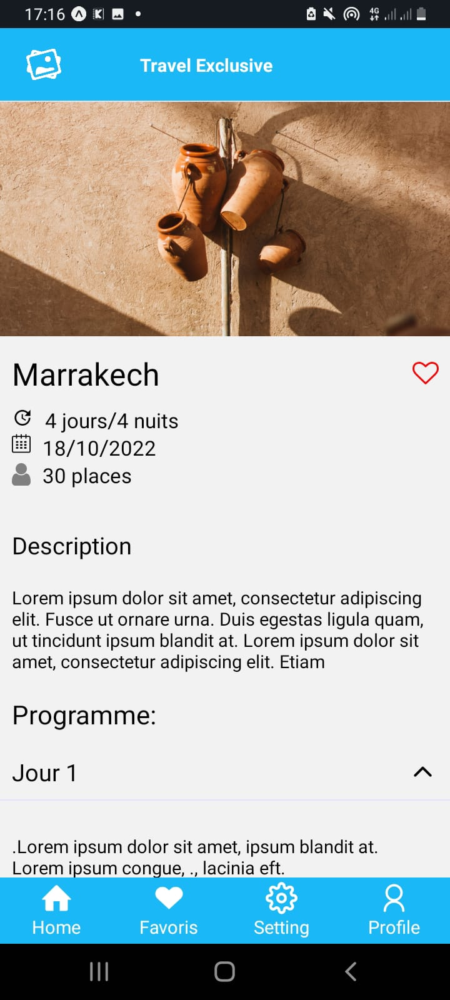
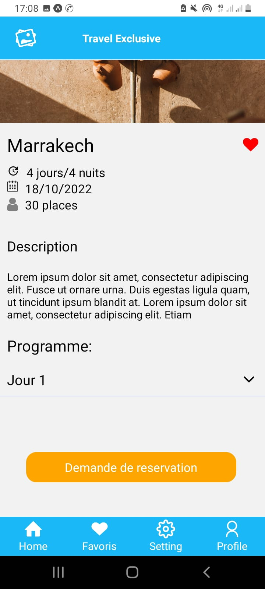
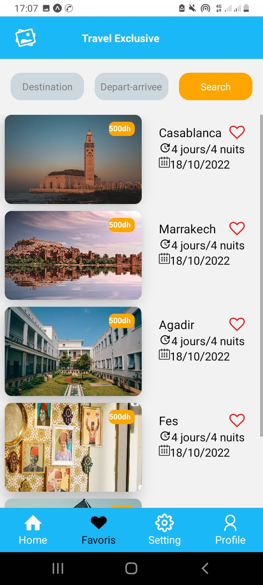

# UX Center Coding challenge

My implementation of UX Center React Native coding challenge.

# Implemented screens

### Home screen

### Profile screen

### Reservation1 first screen

### Reservation second screen

### Setting screen

### Favoris screen

